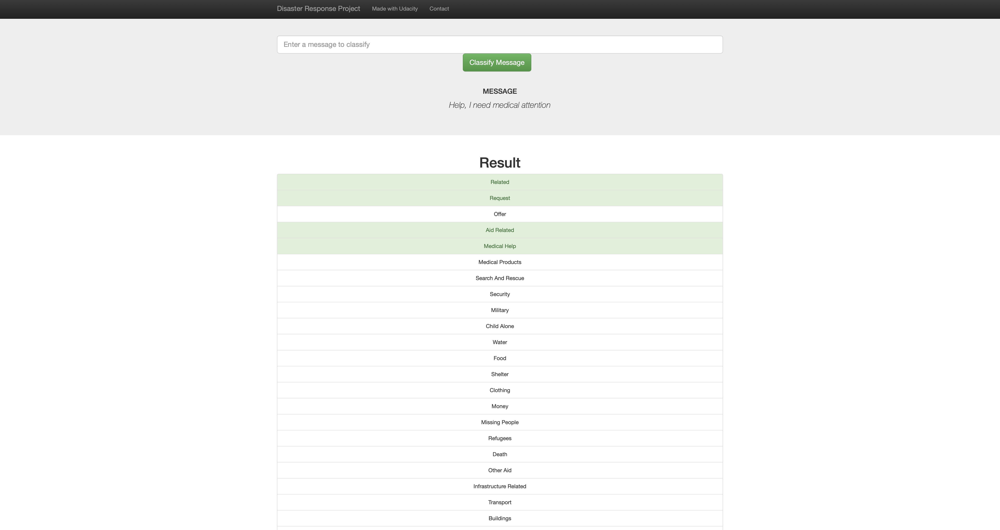
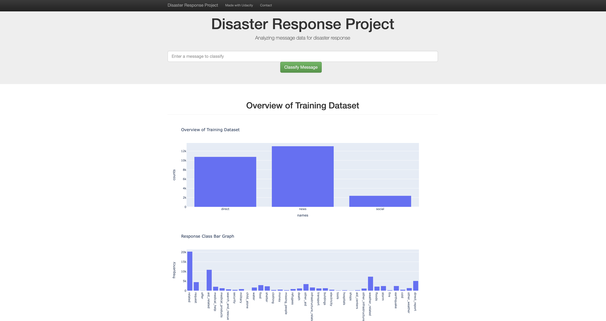

# Disaster Response Pipeline Project

### Installations
See 'requirements.txt' for a full list of dependencies, but some of the more notable ones are:

   * Plotly.express
   * pandas
   * numpy
   * Flask
   * NLTK
   * Sci-kit learn
   * SQLAlchemy
   * Plotly

### Motivation and Summary
In the Project Workspace, you'll find a data set containing real messages that were sent during disaster events. You will be creating a machine learning pipeline to categorize these events so that you can send the messages to an appropriate disaster relief agency.

Your project will include a web app where an emergency worker can input a new message and get classification results in several categories. The web app will also display visualizations of the data. This project will show off your software skills, including your ability to create basic data pipelines and write clean, organized code!

### Files

   * 'ETL Pipeline Preparation.ipynb' - Jupyter notebook for preparing the ETL pipeline and testing the pipeline before it was implemented in 'process_data.py'
   * 'ML Pipeline Preparation.ipynb' - Jupyter notebook for building the classifier
   * 'models/train_classifer.py' - Python script for trainig the message classsifier
   * 'data/process_data.py' - Python script for building the ETL pipeline
   * 'app/run.py' - Python script for running the Flask script
   * 'models/message_categories.db' - SQLite database of the cleaned and tokenized message data
   * 'models/classifier.pkl' - saved classifier for use in 'app/run.py'
   * 'app/templates' - this folder contains the .HTMLs for the Flask app.

### Instructions:
1. Run the following commands in the project's root directory to set up your database and model.

    - To run ETL pipeline that cleans data and stores in database
        `python data/process_data.py data/disaster_messages.csv data/disaster_categories.csv data/DisasterResponse.db`
    - To run ML pipeline that trains classifier and saves
        `python models/train_classifier.py data/DisasterResponse.db models/classifier.pkl`

2. Run the following command in the app's directory to run your web app.
    `python run.py`

3. Go to http://0.0.0.0:3001/

### Results
The results of this project is a web application that displays graphs (bottom) in the welcome page and then possible message categories when an image is input to the text box (top).

### License

